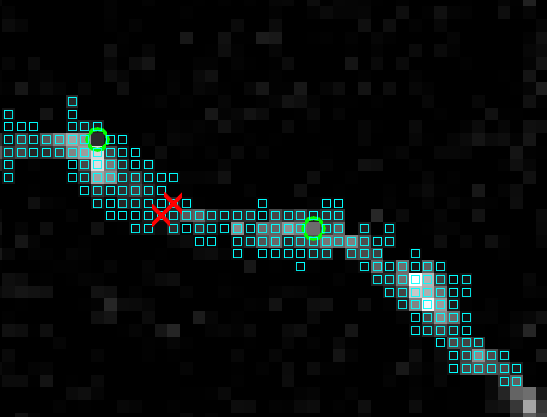

**Demo:**
```matlab
load Demo.mat
[nonsimple,KT,D,T]=FastMarchingTube(im,SVr,30,[1,1,1],true)
```




 - `Green circles`: Starting points `SVr`
 - `Cyan squares`: Visited points `KT==1`
 - `Red crosses`: non-simple points `nonsimple`

**References:**
 - Gala, Rohan, et al. Active learning of neuron morphology for accurate automated tracing of neurites." Frontiers in neuroanatomy 8 (2014): 37
 - G. Bertrand and G. Malandain. A New Characterization of three-dimensional Simple Points. Pattern Recognition Letters, February 1994, volume 2, number 15, pages 169-175.